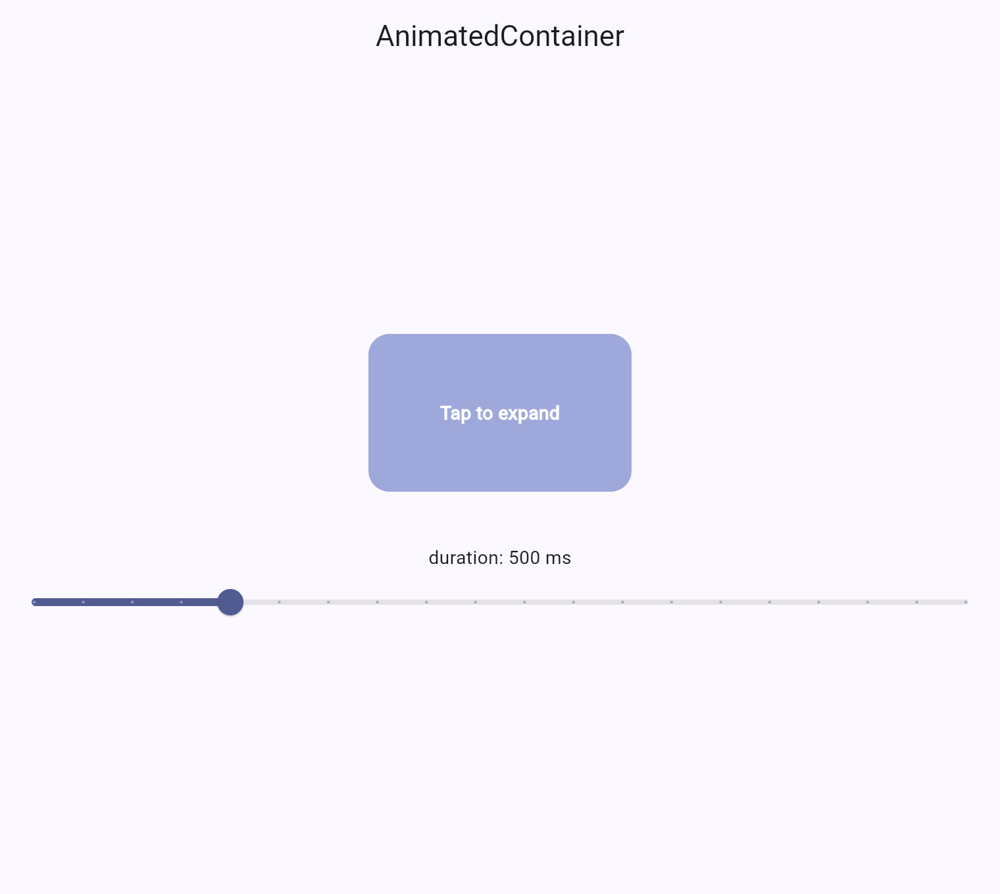
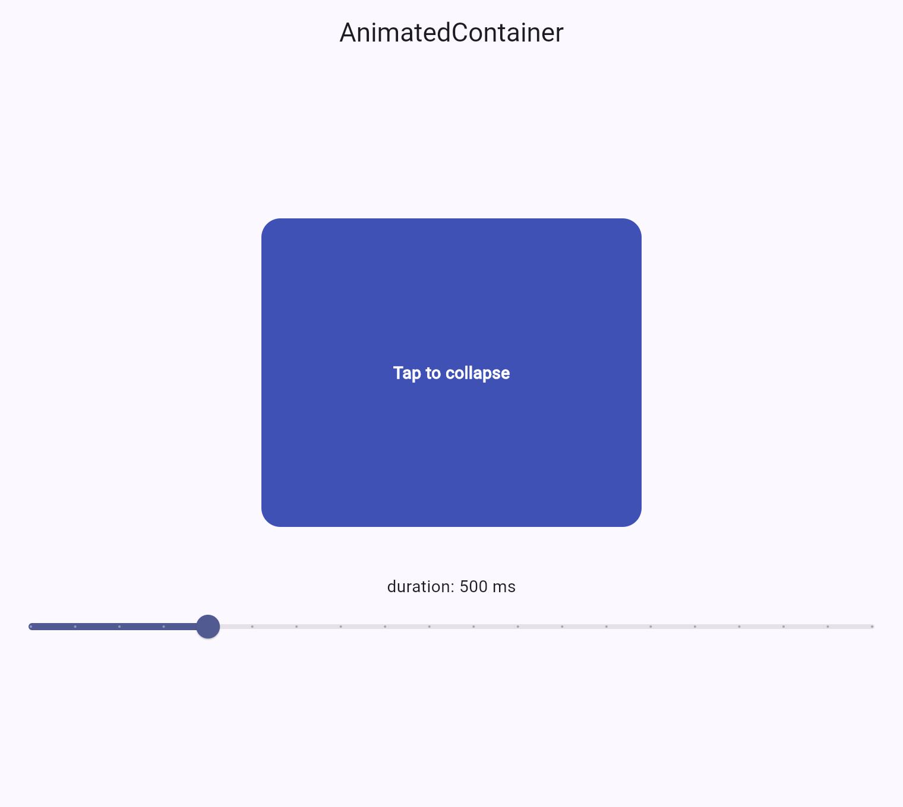

# AnimatedContainer Demo

**In-class presentation date: 8th June 2026**

This is my first proper attempt at a Flutter app, specifically tackling the
`AnimatedContainer` widget. It was honestly a lot of fun to build, and somewhere along
the way it clicked for me what this thing actually is: it's basically a container that
animates *itself*, smoothly, whenever you change its size, colour, or shape.

What's lovely about it is that you don't have to manually animate anything. The
`AnimatedContainer` widget itself takes care of the transition from state A to state B —
you just tell it the new values and it handles the in-between.

To show that off I built a little expandable card. It starts small and light, and when
you tap it the width, height and colour all change together in one smooth motion. I also
added a slider so I can change the animation speed live during the demo.

## Screenshots

Collapsed (default) and expanded states:

| Collapsed | Expanded |
|-----------|----------|
|  |  |

## How to run

You'll need the Flutter SDK. Then:

```bash
flutter pub get
flutter run
```

Pick any device when it asks (I ran it on macOS and Chrome). Tap the card to expand or
collapse it, and drag the slider to change how long the animation takes.

## The three attributes I demonstrate

All three live on the `AnimatedContainer` in `lib/main.dart`.

**1. `duration`** — defaults to `500ms` in my code. This is the one I change live with the
slider (anywhere from 100ms to 2000ms). It sets how long the whole transition takes. Crank
it up to 2000ms and you can watch the card crawl open; drop it to 150ms and it's basically
instant. You'd tune this to get the feel you want — snappy for everyday UI, slower when you
want to draw the eye.

**2. `width`** — goes from `200` collapsed to `320` expanded. When the state flips on tap,
AnimatedContainer tweens the width across instead of snapping. Changing it makes the card
grow sideways, which is how I make room for more content.

**3. `height`** — goes from `120` collapsed to `260` expanded, same idea. It grows the card
downward. Width and height together give you that "card opening up" feel you see in
notification cards and expandable list items.

The whole point is that I never wrote an animation by hand. I just change these values
inside `setState`, and AnimatedContainer animates the difference (Flutter calls this an
*implicit* animation).

## Project structure

- `lib/main.dart` — the whole app: the expandable card and the duration slider.
- `test/widget_test.dart` — a quick test that taps the card and checks it expands.
